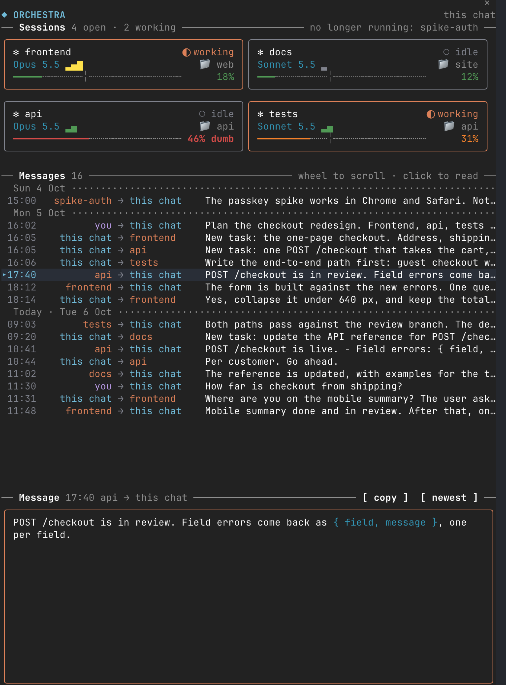
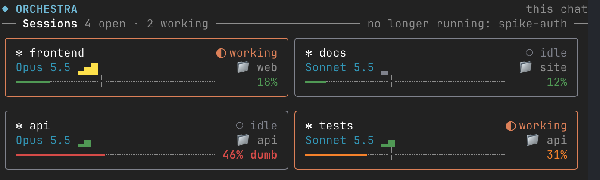
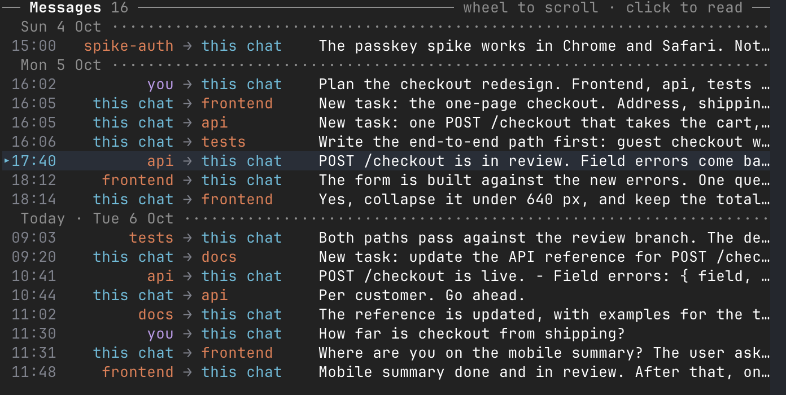
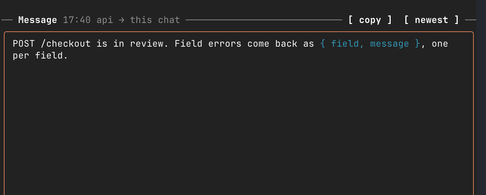

# session-orchestra

**A Claude Code plugin that shows the messages your Claude Code sessions send each other, in a side pane.**

When one session hands work to others (a lead and its teams, a planner and its workers), they talk through `SendMessage`. Those messages end up scattered through each session's transcript. Orchestra reads them back and draws them in one place: which sessions this chat talks to, how each is doing, every message between them, and the one you pick, in full.



## What it is, and what it is not

Orchestra is **a view, and only a view**:

- It **reads** files Claude Code already writes on your machine: the transcripts and Claude Code's list of running sessions.
- It **does not send, change or delete** anything. It is not a messaging channel and adds none: your sessions talk exactly as they did before, through `SendMessage`.
- It **makes no network calls**.
- The only thing it keeps is whether it is on in a session, and which page of cards you were on.

## The pane

### Sessions



One card for each session this chat has messaged or heard from, the most recent first:

- the session's name, and whether it is **working** or **idle**;
- its model, its effort (`▂` low to `▂▄▆█` max) and its folder;
- its context window in use, as a bar marked at 40 %; past 40 % the card says `dumb`.

Six cards to a page (`‹ 1 2 ›`). Sessions that are no longer running are named at the right end of the Sessions line. **Click a session's name** to show only its messages; click it again, or `[ all ]`, to show every one.

### Messages



Every message between you, this chat and those sessions, one line each: time, sender → receiver, the start of the text. A dotted row opens each day. The wheel scrolls the list; `[ ↓ 12 newer ]` jumps back to the newest. **Click a line** to read it.

### Message



The message you clicked, or the newest one, in full, with `**bold**` and `` `code` `` drawn. The wheel scrolls a long one; `[ copy ]` puts it on the clipboard.

The sessions stay where they are while the two lists scroll.

### When the pane is closed


The dim hint line under the prompt ends with a note, next to Claude Code's own (`← 5 agents`): `◆ 4 sessions ⇄ 41`, the sessions this chat talks to and the messages between them. **Click it** to open the pane. In a session where orchestra is off, the note appears once this chat messages another session or hears from one; a click turns orchestra on there. Nothing pops up.

## Install

```sh
claude plugin marketplace add atarazevich/session-orchestra
claude plugin install session-orchestra@session-orchestra
```

Sessions already open pick it up after `/reload-plugins`.

### Upgrading from `orchestra`

The plugin was called `orchestra` before. Uninstall the old one first:

```sh
claude plugin uninstall orchestra@orchestra
```

Sessions that had it on come back with it off after the rename; run `/orchestra on` in them again.

## Use

In the session whose conversations you want to see:

| Command | What it does |
|---|---|
| `/orchestra on` | Turn it on in this session. It stays on when the session resumes. |
| `/orchestra` | Open the pane again. |
| `/orchestra off` | Turn it off in this session. |
| `/orchestra on <session id>` | Show another session's conversations from this one. |
| `/orchestra demo` | Fill the pane with made-up sessions, to try it or take a screenshot. |

The pane docks as a sidebar from 144 terminal columns; at any width `/orchestra` opens it.

## Where each thing comes from

| On screen | Read from |
|---|---|
| Who talks to whom, and every message | This session's transcript: its `SendMessage` calls, the messages other sessions sent it (arrived idle or mid-turn), your prompts. A compacted session is followed back through its earlier transcripts. |
| Working or idle | `~/.claude/sessions/`, Claude Code's own record of the sessions running on this machine (the one `ListAgents` reads). |
| Model, effort, context | The last reply in each session's own transcript. |

If you run your sessions in herdr, its `herdr agent prompt <pane> "…"` sends count as messages too.

## What it runs and what it hooks

Orchestra sends nothing anywhere. The plugin directory asks each plugin to list the programs it starts and the events it hooks, so here they are.

**Programs** it starts, each by name and with no shell:

| Program | Why |
|---|---|
| `tail -c +<offset+1> <transcript>` | Reads a transcript from where it last stopped. The plugin API keeps only the first 4 MiB of a program's output, so a long transcript takes several reads. |
| `head -c 400000 <transcript>` | Reads the start of a transcript to find the earlier transcript a compacted session continues. |
| `tail -c <bytes> <transcript>` | Reads the end of a transcript: another session's model, effort and context, or this chat's latest messages while it is off. |
| `find ~/.claude/projects -maxdepth 2 -name <session id>.jsonl` | Finds a session's transcript. |
| `herdr agent list` | Gets pane names, so herdr sends show the session's name. It runs on every poll and when the earlier transcripts are read; where herdr is not installed the call fails and is ignored. |

**Events it hooks**:

- `session.start`: it registers `/orchestra` and, if orchestra was on in this session, turns it back on and opens the pane. When it was off, or the transcript it watched is gone, it reads the end of this chat's transcript to count its messages for the hint line. The event is passed on unchanged.
- `tool.call` for `SendMessage`: it reads the recipient's name to count the conversation; the call is passed on unchanged.
- `prompt.submit`: for a message from another session, it reads the sender's name; the prompt is passed on unchanged.
- `command.run` for `orchestra`: it answers its own command.
- `ui.render` for its own pane: it draws the pane.
- `ui.message` from `log`: a click on a row of its message list opens that message.
- `ui.scroll` for its own pane: it scrolls the message list or the message itself, and pins the pane (`offset: 0`) so the pane as a whole never scrolls.
- `ui.close`: when its own pane closes, it notes that; the event is passed on unchanged.
- `ui.render` for `PromptHint`: while the pane is closed and this chat talks to other sessions, it replaces the hint line under the prompt with Claude Code's hint plus the clickable note, and drops the "(shift+tab to cycle)" tip when the hint starts with it. Otherwise the line is left as it is.

It adds one command, `/orchestra` (the plugin is session-orchestra; the command keeps the short name). It runs no slash commands, submits no prompts, and makes no network or MCP calls.

## Privacy

It reads only files on your machine and sends nothing. The full statement: [Privacy](https://github.com/atarazevich/session-orchestra/blob/main/PRIVACY.md).

## Requirements and limits

- Claude Code **2.1.289** or newer, in a terminal. It is built on Claude Code's plugin API for function hooks, which is early access and may change between releases.
- It reads Claude Code's transcript format, which is not a public interface; a release can change it. Tested on 2.1.289.
- Context % is computed from the last reply's tokens and the model's window (1M; 200k for Haiku and 4.x models). In testing it matched the status line, but it is not the number Claude Code itself reports.
- Sessions on this machine only.

## Development

```sh
claude plugin validate plugins/session-orchestra
```

Run Claude Code with `--plugin-dir plugins/session-orchestra` to try changes: the folder is watched and reloads on save.
